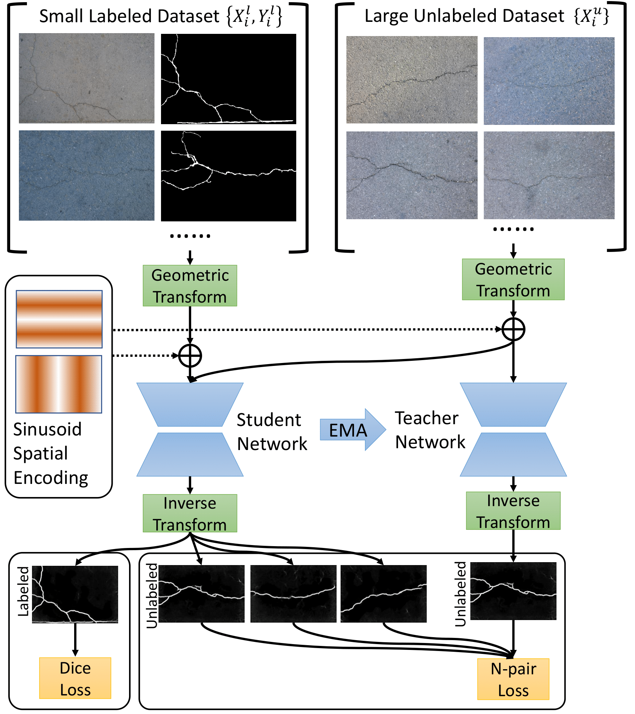

# SemiCurv: Semi-Supervised Curvilinear Structure Segmentation

This is the official repository for <a href="https://arxiv.org/abs/2205.08706">"SemiCurv: Semi-Supervised Curvilinear Structure Segmentation"</a> IEEE TIP 2022. Please cite this work [1] if you find this repository useful for your project.

Recent work on curvilinear structure segmentation has mostly focused on backbone network design and loss engineering. The challenge of collecting labelled data, an expensive and labor intensive process, has been overlooked. While labelled data is expensive to obtain, unlabelled data is often readily available. In this work, we propose SemiCurv, a semi-supervised learning (SSL) framework for curvilinear structure segmentation that is able to utilize such unlabelled data to reduce the labelling burden.



This demo code reproduces the results for semi-supervised segmentation on CrackForest, EM and DRIVE datasets.

Please follow the following pipeline to reproduce the results.

## Requirements

The code is tested under Ubuntu 18.04, CUDA 10.2, PyTorch 1.6.0
Install the required packages through

```
pip install -r requirements.txt
```

## Datasets

Prepare datasets for evaluation.

### CrackForest Dataset

Collect CrackForest dataset by running the following script.

```
mkdir ./Dataset
cd ./Dataset
git clone https://github.com/cuilimeng/CrackForest-dataset.git
```

### EM Dataset

EM128 dataset (cropped patches 128*128 from the original EM dataset [2]). Already provided under /Dataset/EM

### DRIVE Dataset

DRIVE128 dataset (cropped patches 128*128 from the original DRIVE dataset [3]). Already provided under /Dataset/DRIVE

## Run training script

Train fully supervised baseline model and SemiCurv model by running the following script.

```
sh train.sh
```

To change the default dataset, please update inside train.sh script.

```commandline
Dataset=CrackForest # dataset to use [option: CrackForest, EM, DRIVE]
```

### Adaptation to other datasets
You should notice that data augmentation is very important to the success of MT model.
Adjust the affine transformation parameters in /Trainer/trainer_Unet.py l:89-95 accordingly for your own dataset.

## Reference
[1] X. Xu, M. Nguyen, Y. Yazici, K. Lu, H. Min and C. S. Foo., “SemiCurv: Semi-Supervised Curvilinear Structure
Segmentation,“ IEEE Transactions on Image Processing, 2022

[2] I. Arganda-Carreras, S. C. Turaga, D. R. Berger, D. Cireşan, A. Giusti,
L. M. Gambardella, J. Schmidhuber, D. Laptev, S. Dwivedi, J. M.
Buhmann et al., “Crowdsourcing the creation of image segmentation
algorithms for connectomics,” Frontiers in neuroanatomy, 2015.

[3] J. Staal, M. D. Abramoff, M. Niemeijer, M. A. Viergever, and `
B. Van Ginneken, “Ridge-based vessel segmentation in color images
of the retina,” IEEE transactions on medical imaging, 2004.
